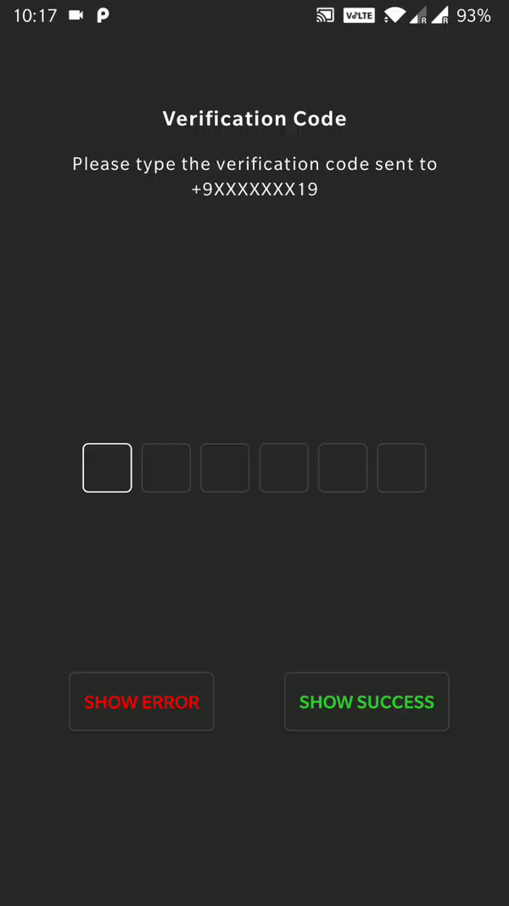
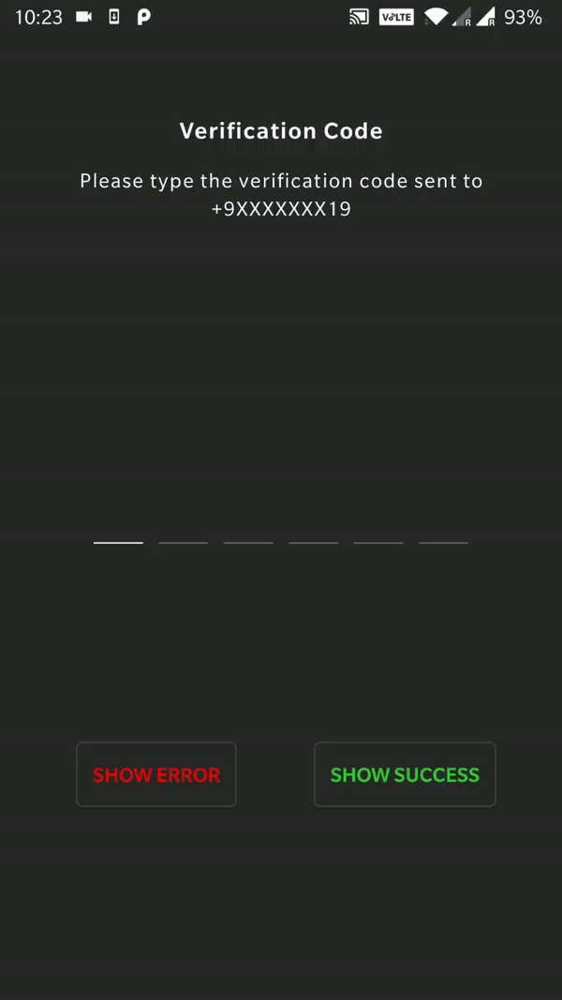

<h1 align="center">OtpView</h1>
<p align="center">
<a href="https://www.codacy.com/app/aabhasr1/OtpView?utm_source=github.com&amp;utm_medium=referral&amp;utm_content=aabhasr1/OtpView&amp;utm_campaign=Badge_Grade"></a>
  <a href="https://travis-ci.org/aabhasr1/OtpView"></a>
  <a href="https://jitpack.io/#aabhasr1/OtpView"></a>
  <a href="https://jitpack.io/#aabhasr1/OtpView"></a>
  <a href="https://android-arsenal.com/details/1/7514"></a>
  <a href="LICENSE">
  </a>
  </p>
  <p align="center">
   An OTP Box implementation for case when a single digit should be entered Individually.
</p>
<p align="center">
 &nbsp;&nbsp;
 &nbsp;&nbsp;
<br><br>
 &nbsp;&nbsp;
 &nbsp;&nbsp;
</p>

## Installation in your Project
Step 1. Add the JitPack repository to your build file. Add it in your root build.gradle at the end of repositories:
```java
allprojects {
	repositories {
		...
		maven { url 'https://jitpack.io' }
	}
}
```
Step 2. Add the dependency
```java
dependencies {
        implementation 'com.github.aabhasr1:OtpView:v1.1.2-ktx' // kotlin
}
  ```
  or
```java
dependencies {
        implementation 'com.github.aabhasr1:OtpView:v1.1.2'
}
  ```
 
## How to use the library?
Just add the following to your **xml** design to show the otpview
```xml
.....
<in.aabhasjindal.otptextview.OtpTextView
	android:id="@+id/otp_view"
	android:layout_width="wrap_content"
	android:layout_height="wrap_content"
	android:textColor="#ffffff"
	app:height="40dp"
	app:width="40dp"
	app:bar_enabled="true"
	app:bar_height="2dp"
	app:length="4"
	app:otp="1234"
	app:otp_text_size="24dp"/>
.....
  ```

To get a callback when the user enters the otp make use of `OTPListener` Interface

```java
private OtpTextView otpTextView;
otpTextView = findViewById(R.id.otp_view);
otpTextView.setOtpListener(new OTPListener() {
	@Override
	public void onInteractionListener() {
	// fired when user types something in the Otpbox
	}
	@Override
	public void onOTPComplete(String otp) {
	// fired when user has entered the OTP fully.
	    Toast.makeText(MainActivity.this, "The OTP is " + otp,  Toast.LENGTH_SHORT).show();
    }
});
  ```
you also get some additional methods like :
```java
otpTextView.getOtpListener();  // retrieves the current OTPListener (null if nothing is set)
otpTextView.requestFocusOTP();	//sets the focus to OTP box (does not open the keyboard)
otpTextView.setOTP(otpString);	// sets the entered otpString in the Otp box (for case when otp is retreived from SMS)
otpTextView.getOTP();	// retrieves the OTP entered by user (works for partial otp input too)
otpTextView.showSuccess();	// shows the success state to the user (can be set a bar color or drawable)
otpTextView.showError();	// shows the success state to the user (can be set a bar color or drawable)
otpTextView.resetState();	// brings the views back to default state (the state it was at input)
  ```
Thats all for now but new additions will be made frequently.

## OtpView Attributes

| Attribute | Use |
| ----------| --- |
| android:textColor | sets the color of the otp text |
| app:otp | sets the otp in the otp view |
| app:length | sets the no of otp box in the otp view |
| app:otp_text_size | sets the otp text size in the otp view |
| app:text_typeface | sets the otp text typeface in the otp view |
| app:hide_otp | sets if the otp entered is to be shown to the user |
| app:hide_otp_drawable | replaces the pin bullet which is shown to the user when hide_otp is enabled|
| app:height | sets the height of each box inside the otp view |
| app:width | sets the width of each box inside the otp view |
| app:box_margin | sets the space between each box in otp view |
| app:box_margin_left | sets the left space between each box in otp view |
| app:box_margin_right | sets the right space between each box in otp view |
| app:box_margin_top | sets the top space of each box in otp view|
| app:box_margin_bottom | sets the bottom space of each box in otp view |
| app:bar_enabled | shows a bar below each otp box to the user |
| app:bar_height | sets the bar height |
| app:bar_margin | sets the bar margin within each box in otp view |
| app:bar_margin_left | sets the bar left margin within each box in otp view |
| app:bar_margin_right | sets the bar right margin within each box in otp view |
| app:bar_margin_top | sets the bar top margin within each box in otp view |
| app:bar_margin_bottom | sets the bar bottom margin within each box in otp view |
| app:bar_active_color | sets the bar color when the cursor is on the box in otp view |
| app:bar_inactive_color | sets the bar color when the cursor is not on the box in otp view |
| app:bar_error_color | sets the bar color for error state in otp view |
| app:bar_success_color | sets the bar color for success state in otp view |
| app:otp_box_background | sets the box background in otp view |
| app:otp_box_background_active | sets the box background when the cursor is on the box in otp view |
| app:otp_box_background_inactive | sets the box background when the cursor is not on the box in otp view |
| app:otp_box_background_error | sets the box background for error state in otp view |
| app:otp_box_background_success | sets the box background for success state in otp view |

## Author
Maintained by  [Aabhas Jindal](https://github.com/aabhasr1)

## Contribution
-   Bug reports and pull requests are welcome.
-   Make sure you use  [square/java-code-styles](https://github.com/square/java-code-styles)  to format your code.

## License
```
MIT License

Copyright (c) 2019 Aabhas Jindal

Permission is hereby granted, free of charge, to any person obtaining a copy
of this software and associated documentation files (the "Software"), to deal
in the Software without restriction, including without limitation the rights
to use, copy, modify, merge, publish, distribute, sublicense, and/or sell
copies of the Software, and to permit persons to whom the Software is
furnished to do so, subject to the following conditions:

The above copyright notice and this permission notice shall be included in all
copies or substantial portions of the Software.

THE SOFTWARE IS PROVIDED "AS IS", WITHOUT WARRANTY OF ANY KIND, EXPRESS OR
IMPLIED, INCLUDING BUT NOT LIMITED TO THE WARRANTIES OF MERCHANTABILITY,
FITNESS FOR A PARTICULAR PURPOSE AND NONINFRINGEMENT. IN NO EVENT SHALL THE
AUTHORS OR COPYRIGHT HOLDERS BE LIABLE FOR ANY CLAIM, DAMAGES OR OTHER
LIABILITY, WHETHER IN AN ACTION OF CONTRACT, TORT OR OTHERWISE, ARISING FROM,
OUT OF OR IN CONNECTION WITH THE SOFTWARE OR THE USE OR OTHER DEALINGS IN THE
SOFTWARE.
   ```
